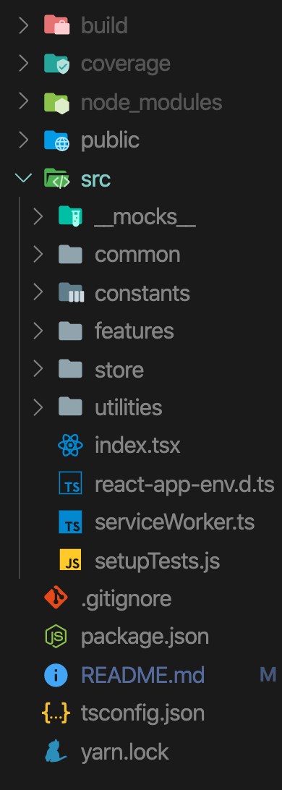
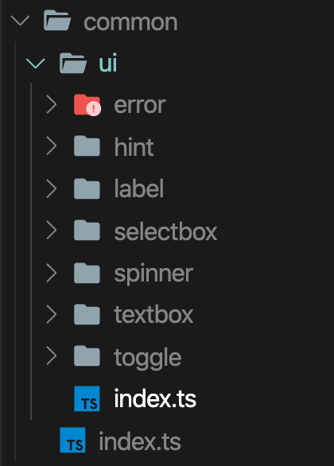
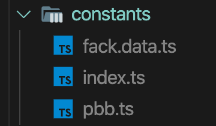
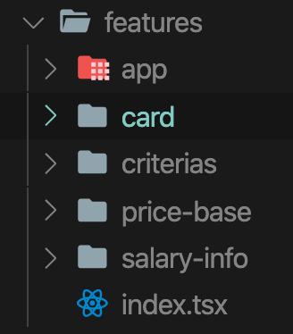
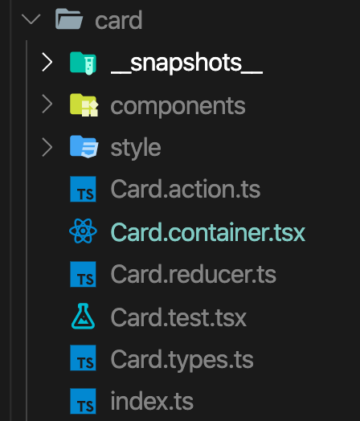
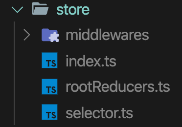
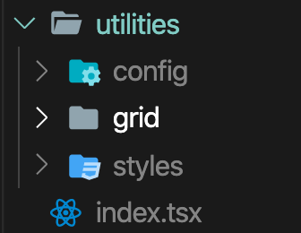
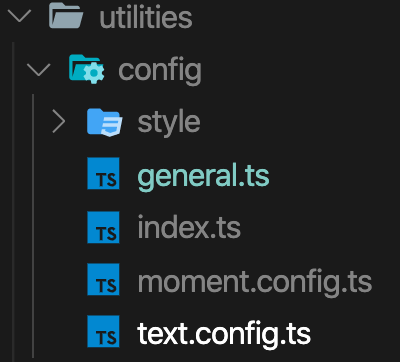

# Föräldrakollen

At Dynabyte, we offer our employees a strengthened parental salary, which means that we increase the `Försäkringskassan's` compensation when you are at home with your child.

---

### Tools and Library

| Tools                                                   | Description                                                                                                                                                                       |
| ------------------------------------------------------- | --------------------------------------------------------------------------------------------------------------------------------------------------------------------------------- |
| [**React**](https://reactjs.org/)                       | JavaScript library for building user interfaces                                                                                                                                   |
| [**Redux**](https://redux.js.org/)                      | Predictable State Container for JS Apps                                                                                                                                           |
| [**Styled-Components**](https://styled-components.com/) | library that allows you to write actual CSS code to style your components by using CSS and ES6 💅.                                                                                |
| [**TypeScript**](https://www.typescriptlang.org/)       | is an open-source programming language developed and maintained by Microsoft. It is a strict syntactical superset of JavaScript, and adds optional static typing to the language. |

## Design Patterns & Project Structures

With Föräldrakollen followed `Domain-Style Structure:` separate folders per feature or domain, possibly with sub-folders per file type.

which is Redux-Recommended Code Structures.
[Read more >>](https://www.learnhowtoprogram.com/react/advanced-topics/react-and-redux-design-patterns)

### Common

The directory containing all ui components that can use them in many places such as label, selectbox, spinner, textbox and toggle button and as usual each component or folder has index file that allows exporting all files.

Each component has:

1. **style** The directory containing styled-components components and index file.
2. Typescript Interface which starts with I[Component-name] in our case **IHint.ts**
3. **index.ts**

### Constants

It's containing all project constants such as Prisbasbelopp, fack data for testing and index.ts.

- How to add new PBB
  1. Go to src > constants
  2. In **`pbb.ts`**
  3. On the second-row press enter
  4. Open double quotation and write the year then write: after that write the PBB
     Example: `"2021": 48500,`

### features

As I said with Föräldrakollen followed `Domain-Style Structure:` separate folders per feature or domain, possibly with sub-folders per file type.

The directory containing all features such as card, criterias, price-base and salary-info.

 

- Each feature contains:

  1. components: The directory containing all React components that belong to the same feature.
  2. style: The directory containing styled-components components that belong to the same feature.

  3. [feature-name].container: This file connects the react components to the Redux store. With this pattern, we can separate the React components from the Redux store.
  4. [feature-name].reducer: each feature has a reducer.
  5. [feature-name].action: each feature has a action that is a payload of information that send data from your application to the store.
  6. [feature-name].type: each feature has a type file which contains all constants type and feature's interface.
  7. [feature-name].test: each feature has a test file which contains all automation test (enzyme and jest).
  8. index.ts: each feature has a index file which allows to export everything

### store

The directory containing all major Redux files such as rootReducers, selector, middleware and index.ts

- rootReducers: contains all Reducers that imported from all features.

- selector: functions that can be used to efficiently compute derived data/state from the Redux store.

- middleware: Redux middleware is the main execution task is the store’s dispatch function. The dispatch function is responsible for sending actions to one or many reducer functions for state changes.

- index.ts: the configuration of store and exports all AppState, AppActions, and middlewares.

### utilities

The directory containing all project configurations and global layout and style.

---

This project was bootstrapped with [Create React App](https://github.com/facebook/create-react-app).

## Available Scripts

In the project directory, you can run:

### `npm start`

Runs the app in the development mode. 
Open [http://localhost:3000](http://localhost:3000) to view it in the browser.

The page will reload if you make edits. 
You will also see any lint errors in the console.

### `npm test`

Launches the test runner in the interactive watch mode. 
See the section about [running tests](https://facebook.github.io/create-react-app/docs/running-tests) for more information.

### `npm run build`

Builds the app for production to the `build` folder. 
It correctly bundles React in production mode and optimizes the build for the best performance.

The build is minified and the filenames include the hashes. 
Your app is ready to be deployed!

See the section about [deployment](https://facebook.github.io/create-react-app/docs/deployment) for more information.

### `npm run eject`

**Note: this is a one-way operation. Once you `eject`, you can’t go back!**

If you aren’t satisfied with the build tool and configuration choices, you can `eject` at any time. This command will remove the single build dependency from your project.

Instead, it will copy all the configuration files and the transitive dependencies (Webpack, Babel, ESLint, etc) right into your project so you have full control over them. All of the commands except `eject` will still work, but they will point to the copied scripts so you can tweak them. At this point you’re on your own.

You don’t have to ever use `eject`. The curated feature set is suitable for small and middle deployments, and you shouldn’t feel obligated to use this feature. However we understand that this tool wouldn’t be useful if you couldn’t customize it when you are ready for it.

## Learn More

You can learn more in the [Create React App documentation](https://facebook.github.io/create-react-app/docs/getting-started).

To learn React, check out the [React documentation](https://reactjs.org/).
